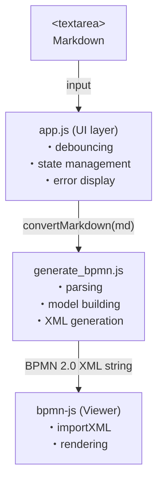

# Markdown2BPMN — Web UI

[日本語版 / Japanese](./README.ja.md)

A web app that **converts business flows written in Markdown into BPMN diagrams in real time, right in your browser**.
No server, no installation, no build step. Just open `index.html`.

  

---

## Features

- **Zero install**: HTML/CSS/JS only. No Python or Node.js required
- **Real-time preview**: Auto-converts 800ms after typing stops; `Ctrl+Enter` for instant conversion
- **High-quality rendering via bpmn-js**: Zoom, pan, and fit operations supported
- **`.bpmn` export**: Output files can be opened in Camunda Modeler / bpmn.io
- **Compatible with the Python version**: Same Markdown syntax as `../generate_bpmn.py`

> Only bpmn-js is fetched from the unpkg CDN, so **an internet connection is required on first launch**.

---

## Quick Start

### Option 1: Open the file directly (easiest)

```powershell
# Windows
Start-Process .\index.html

# Or just double-click index.html
```

### Option 2: Serve via a local HTTP server (recommended)

```powershell
python -m http.server 8000
# → Open http://localhost:8000/ in your browser
```

Once opened, the sample Markdown in the left pane is automatically rendered as a BPMN diagram in the right pane.

---

## Layout

```
┌─────────────────────────────────────────────────────────┐
│ Markdown2BPMN          [▶ Convert] [↓ Export]            │ ← Header
├──────────────────────┬──────────────────────────────────┤
│ Markdown             │ BPMN Diagram                     │
│ ┌──────────────────┐ │ ┌──────────────────────────────┐ │
│ │ ---              │ │ │                              │ │
│ │ process_id: ...  │ │ │     ○──[Task]──[Task]──◯    │ │
│ │ ---              │ │ │                              │ │
│ │ ## Lanes         │ │ │            [Fit]             │ │
│ │ ...              │ │ └──────────────────────────────┘ │
│ │                  │ │                                  │
│ └──────────────────┘ │                                  │
│ ● Converted — 18:42:31│                                 │ ← Status bar
└──────────────────────┴──────────────────────────────────┘
       Left pane                  Right pane
```

Drag the vertical divider in the center to resize the panes.

---

## Controls

| Action                  | Behavior                                            |
|-------------------------|-----------------------------------------------------|
| Type text               | Auto-convert after 800ms                            |
| `Ctrl+Enter`            | Convert immediately                                 |
| `▶ Convert` button      | Convert immediately                                 |
| `↓ Export` button       | Download the current diagram as a `.bpmn` file      |
| `⊡ Fit` button          | Fit the entire diagram to the viewport              |
| `Tab` key (in editor)   | Insert 2 spaces                                     |
| Drag center divider     | Resize panes                                        |

---

## Markdown Syntax

See the parent project's [README](../README.md) for the full specification.

### Minimal example

```markdown
---
process_id: my-process
process_name: Sample Process
---

## Lanes
- **Actor A** (actor_a): description
- **Actor B** (actor_b): description

## Flow
1. [actor_a] Start task
2. [actor_b] End task <END>
```

### Syntax cheat sheet

| Syntax                  | Meaning                              |
|-------------------------|--------------------------------------|
| `N. [lane_id] task`     | Regular task                         |
| `<GW: label>`           | Exclusive gateway (conditional)      |
| `<GW\|\|: label>`       | Parallel gateway                     |
| `<END>`                 | End event                            |
| `→ N`                   | Jump to step N                       |
| `- condition → N`       | Gateway branch                       |
| `- (default) → N`       | Default branch                       |

---

## Architecture



| File                  | Role                                                                       |
|-----------------------|----------------------------------------------------------------------------|
| `index.html`          | Defines the layout and script load order                                   |
| `css/style.css`       | All styles (2-pane layout, header, buttons, etc.)                          |
| `js/generate_bpmn.js` | Public API: `convertMarkdown(text)` — converts Markdown to BPMN 2.0 XML    |
| `js/sample.js`        | Sample Markdown shown on startup                                           |
| `js/app.js`           | DOM operations, events, bpmn-js integration                                |

`generate_bpmn.js` is a hand port of `./markdown2bpmn.py` to JavaScript. Layout constants, validation IDs, and syntax are all kept in sync with the Python version.

---

## Known Limitations

- **No file drag-and-drop for opening Markdown** (use copy-paste instead)
- **bpmn-js is a read-only Viewer** (no modeler bundled — edit with Camunda Modeler if needed)
- **Cannot launch offline on first run** (bpmn-js is fetched from unpkg)
- **No mobile / tablet support** (desktop-only layout)

---

## Related Projects (in this repo)

| Project              | Path                  | Purpose                                              |
|----------------------|-----------------------|------------------------------------------------------|
| Python CLI version   | `./markdown2bpmn.py`  | CLI usage when this directory is distributed alone   |
| **This project**     | `./` (webui)          | Self-contained browser app for local use             |

### Using the bundled CLI

```powershell
python .\markdown2bpmn.py <input.md> [-o <output.bpmn>] [--validate] [--verbose]
```

---

## Related Projects (external)

- [bpmn2visio](https://github.com/NAKADANobuhiro/bpmn2visio/): A tool that converts BPMN 2.0 XML into Microsoft Visio `.vsdx` files

## Version History

| Version | Date       | Notes                                                |
|---------|------------|------------------------------------------------------|
| 0.1.0   | 2026-05-12 | Initial release (ported from Python version v1.1.1) |
